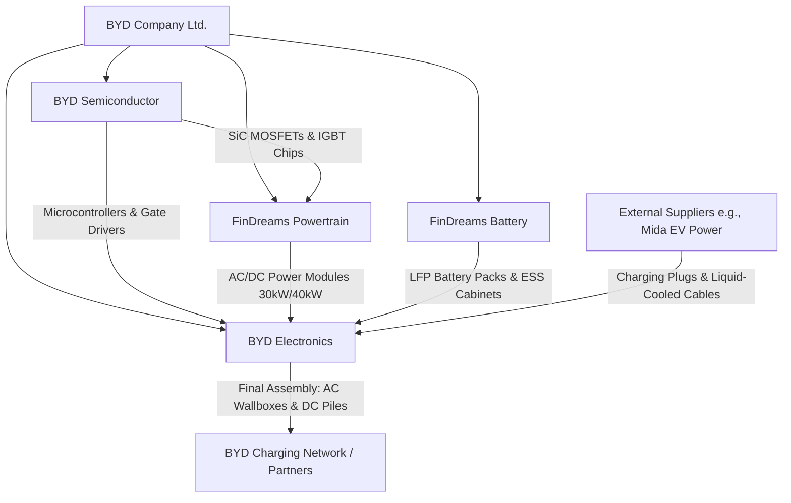

# Deep Dive: BYD EV Charging Ecosystem (2026 Industry Report)

This report provides a comprehensive analysis of BYD’s electric vehicle (EV) charging technology, its vertical manufacturing structure, the specific subsidiaries making its components, and the strategic implications for the EV charging business in Bangladesh.

---

## 1. Executive Summary: The BYD Playbook
In the EV charging landscape, most brands (e.g., ChargePoint, EVBox, Autel, Wallbox) act as system integrators or operators. They buy power modules from third parties (like Sinexcel or Infypower), assemble them in chassis, and run software. 

**BYD (Build Your Dreams) operates on an entirely different scale.** It is a hyper-vertically integrated energy giant. BYD designs and manufactures:
1. The **semiconductors** (Silicon Carbide MOSFETs/IGBTs) that switch the power.
2. The **battery cells** (Blade Battery) that receive the charge.
3. The **power conversion modules** (On-board chargers, DC-DC converters, charging piles).
4. The **energy storage systems (ESS)** that buffer the grid.
5. The **electric vehicles** themselves.
6. The **charging networks** (in collaboration with regional distributors like CG-Runner/Runner Group in Bangladesh).

This full-stack ownership allows BYD to bypass supply chain bottlenecks, aggressively cut costs, and optimize the charging curve (thermal and electrical) between the car and the charger in ways that traditional charger companies cannot match.

---

## 2. Latest 2026 BYD Charging Technical Updates

By mid-2026, BYD has introduced several breakthrough technologies that redefine high-power charging standards:

### A. 1.5 MW "Flash Charging 2.0"
*   **Peak Power:** Up to 1,500 kW (1.5 Megawatts) per connector.
*   **Performance:** Adds approximately 400 km (250 miles) of range in just 5 minutes.
*   **Charging Rate:** Supports up to a **10C rate** (charging the battery at ten times its capacity rating).
*   **Target Vehicles:** Launched alongside the 2026 flagship models—**Great Tang (Da Tang)** and the **Denza Z9GT**—which feature 1,000V high-voltage platforms.
*   **Cold Weather Performance:** Engineered to maintain high speeds in extreme conditions (e.g., charging from 20% to 97% in 12 minutes at -30°C).

### B. Second-Generation Blade Battery
*   **Release Date:** March 5, 2026.
*   **Advancement:** Features a higher energy density (moving from ~150 Wh/kg to ~190 Wh/kg) while upgrading its chemical formulation to support ultra-fast 10C charging without experiencing thermal runaway.
*   **Integration:** Designed to interface directly with BYD's intelligent liquid-cooling charging cables to maintain optimal battery temperatures during megawatt-level energy transfers.

### C. "Dual-Gun" Charging Technology
*   **Concept:** For vehicles that cannot support megawatt-level inputs via a single plug, BYD patented a dual-port design.
*   **Mechanism:** Allows a single vehicle to plug into two separate DC fast chargers (e.g., two 120kW chargers) simultaneously, pulling a combined 240kW. This bypasses the need for expensive infrastructure upgrades at older charging stations.

### D. BESS-Buffered Charging Stations
*   **Grid Buffer:** High-power charging (especially 150kW+ and MW-class) destroys weak grids like Bangladesh's.
*   **Solution:** BYD pairs its fast chargers with in-house **Battery Energy Storage Systems (BESS)**. The BESS slowly trickles energy from the grid during off-peak hours and discharges it at high power during vehicle charging, keeping the grid stable.

---

## 3. Supply Chain Deep-Dive: Who Makes the Parts?

If you disassemble a BYD charger, you will not find standard components off the shelf. BYD's captive supply chain relies on three major wholly-owned subsidiaries and a select group of specialized suppliers.

### The Key Companies Behind the Hardware

| Subsidiary / Partner | Role in Charging Equipment | Manufacturing Details |
| :--- | :--- | :--- |
| **BYD Semiconductor Co., Ltd.** | **Power Semiconductors (Chips)** | Designs and fabs **Silicon Carbide (SiC) MOSFETs** and **IGBT 4.0/5.0 modules**. These chips convert high-voltage AC grid power to DC battery power. Owning the fab is BYD's ultimate competitive advantage during chip shortages. |
| **FinDreams Powertrain Co., Ltd.** | **Power Conversion Modules** | Assembles the raw chips into **30kW and 40kW AC-to-DC power modules** (the internal bricks of DC chargers) and On-Board Chargers (OBCs) for vehicles. |
| **FinDreams Battery Co., Ltd.** | **Grid Buffering & Battery Packs** | Manufactures the **Blade Battery cells** and the industrial-scale **LFP battery cabinets (BESS)** used to buffer supercharging stations. |
| **BYD Electronics (International)** | **Assembly & EMS** | A publicly listed contract manufacturer (HK: 0285). They print the PCBs, manufacture the outer sheet-metal casing, handle electrical integration, and perform final assembly of the AC Wallboxes and DC fast charging stations. |
| **Shanghai Mida EV Power Co., Ltd.** | **Connectors & Cables** *(Strategic Partner)* | A major external supplier that collaborates with BYD to provide high-current liquid-cooled charging cables and CCS2/Type 2 plugs. |

---

## 4. BYD's Strategic Layout in Bangladesh (2026 Status)

BYD is rapidly establishing itself as the premier EV ecosystem player in Bangladesh. Their strategy is tightly integrated with local industrial conglomerates.

### A. The CG-Runner & Runner Automobiles Deal
*   **Distribution:** **CG-Runner BD Ltd.** is the official distributor of BYD passenger vehicles in Bangladesh.
*   **Local Assembly:** In **March 2026**, **Runner Automobiles PLC** signed a master supply and manufacturing agreement with BYD to establish a **local assembly plant for BYD EVs** in Bangladesh.
*   **Infrastructure Moat:** BYD auto sales are bundled with home chargers, and CG-Runner is building a proprietary dealer charging network to reduce range anxiety for buyers.

### B. Current Charging Network Footprint
BYD's charging network in Bangladesh is strategically placed along major highway corridors to facilitate inter-city travel:
*   **Dhaka:** Tejgaon (AC Charger hub)
*   **Cumilla:** Chewra, Kabab Express (DC Fast Charger - crucial Dhaka-Chittagong midpoint)
*   **Chattogram:** The Peninsula (AC Charger)
*   **Cox’s Bazar:** Sayeman Beach Resort (AC Charger)
*   **Rajshahi:** Borobongram, Rajshahi Bypass (DC Fast Charger)
*   **Expansion Sites:** Bogra (Momo Inn), Mawa (Padma Bridge access), and Sylhet (Hotel Noorjahan Grand).

### C. Local Operations & Software Partnerships
Rather than operating the chargers themselves, BYD and CG-Runner partner with local entities:
*   **Genex Infrastructure:** Signed MoUs to install and maintain the physical charging stations.
*   **Ekhon Charge & B-Charge:** Local charge point operators (CPOs) whose mobile apps and management software are integrated to handle booking, billing, and session control for BYD users.

---

## 5. Strategic Assessment for Your EV Charging Business

As a software-focused entrepreneur looking to enter the Bangladesh EV charging market, here is how you should evaluate BYD:

### A. The Bad News: You Cannot Buy From BYD's Supply Chain
*   **Captive System:** BYD does not sell its charging modules, SiC chips, or branded wallboxes to independent distributors or DIY builders. Their hardware is exclusively reserved for their vehicles, official dealers, and certified network partners.
*   **High Capital Barrier:** Competing directly with BYD's infrastructure requires millions of dollars in capital, grid-transformer permissions, and direct relations with the government.

### B. The Good News: BYD's Success Creates Your Market
*   **Vehicle Volume:** BYD is driving the volume of EVs on Bangladesh roads. More BYD cars mean more demand for third-party public charging stations.
*   **The OCPP Software Moat:** Currently, local operators like *Ekhon Charge* and *B-Charge* have very basic software capabilities. Your background (e.g., Monta OCPP platform) is a massive advantage. 
*   **Interoperability Demand:** BYD vehicles in Bangladesh use **CCS2 (for DC) and Type 2 (for AC)**. They do *not* use Chinese GB/T plugs locally. This means any standard European/IEC compliant charger you import from Tier 1/2 Chinese OEMs (like Sigenergy or Joint Tech) will work perfectly with BYD cars.

### Strategic Recommendations

1.  **Do Not Attempt to Compete on Megawatt Charging:** 
    1.5 MW charging is irrelevant for Bangladesh in 2026. The country's national grid cannot support it without dedicated, million-dollar substations. Focus on **7kW–22kW AC chargers** for commercial/residential properties and **30kW–60kW DC chargers** for highway points.
2.  **Target the "Sigenergy V2H" Load-Shedding Pitch:** 
    Since BYD vehicles use standard CCS2 ports, you can import V2H-capable (Vehicle-to-Home) chargers like **Sigenergy** (founded by ex-Huawei engineers). You can pitch this to wealthy Dhaka homeowners: *"Use your BYD car as a backup generator during load shedding."* BYD's own chargers do not easily support bidirectional V2H in the local market yet.
3.  **Partner, Don't Compete with CG-Runner:**
    Instead of trying to import competing chargers to sell to individuals, approach CG-Runner. Offer to integrate their dealer charging network into a premium, OCPP-compliant software management platform (using your software background) to improve their uptime, payment processing (bKash/Nagad integration), and user experience.
4.  **Import from Open OEMs:**
    For hardware, source from **Joint Tech** or **Iocharger**. They provide OCPP 1.6J/2.0.1 compliant chargers, offer full OEM/ODM white-labeling, and are eager to supply independent distributors in South Asia.
