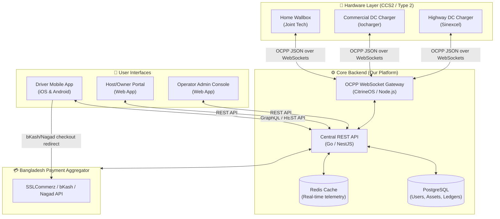

# EV Charging Software Ecosystem Architecture (Bangladesh Market)
**Document Version:** 1.0 | **Status:** Approved Architecture Draft
**System Model:** OCPP-based Platform & CPO Operator Network

This document details the software segment of our EV charging business. It describes how charge point owners (hosts) manage their hardware and receive payouts, how EV drivers locate and pay for charging sessions, and how we administer the entire national network as the central platform operator.

---

## 🗺️ 1. Complete Software Ecosystem Architecture

Our software platform operates as a multi-tier SaaS and CPO system. It uses **OCPP (Open Charge Point Protocol) 1.6J and 2.0.1** to abstract the hardware layer, ensuring we can mix and match Chinese chargers (Sinexcel, Iocharger, Joint Tech) without modifying our applications.

### System Overview & Data Flow


### Technical Stack Recommendations
* **OCPP Server Core:** Custom-wrapped **CitrineOS** (Node.js/TypeScript) or a microservices-based Go implementation. Open-source foundations provide standard compliance out-of-the-box, allowing us to focus development hours on billing and localized UI features.
* **Database:** PostgreSQL (with TimescaleDB extension for time-series telemetry logging like voltage and charging speed metrics).
* **Caching & WebSockets:** Redis for holding live charge-session states and managing WebSocket pub/sub instances across load-balanced nodes.
* **Frontends:** React for Web Portals, Flutter or React Native for the iOS/Android driver app to maintain a single codebase.

---

## 👥 2. Driver Experience (How Customers Charge)

The driver's journey must be friction-free, supporting both registered members and ad-hoc guests.

### Flow A: Registered Member (Via App)
1. **Discover:** The driver opens the app, sees a map of chargers, filters by power speed (AC/DC) and status, and sees real-time occupancy.
2. **Pair & Start:** 
   * The driver plugs the CCS2/Type 2 cable into their vehicle.
   * They scan the QR code sticker on the charger housing using the app.
   * The app matches the QR code to the active OCPP `chargePointId` and displays the host's tariff (e.g., BDT 18/kWh).
3. **Pre-Authorization:** The app requests a bKash/Nagad pre-authorization or uses the user's stored wallet balance (e.g., pre-auth BDT 500).
4. **Charge:** App invokes the `RemoteStartTransaction` OCPP command. The charger locks the connector and initiates power transfer. Real-time telemetry (kWh delivered, charging rate in kW, elapsed time, current cost) is streamed to the user's screen.
5. **Complete:** The driver clicks "Stop" in the app (or the car battery hits 100%). The backend sends `RemoteStopTransaction`. The connector unlocks. The final cost is calculated (e.g., BDT 340).
6. **Billing:** The backend settles the pre-authorized transaction, charges the BDT 340, and instantly refunds the remaining BDT 160. A digital invoice is sent via SMS/Email.

### Flow B: Ad-Hoc Guest (No App Download)
1. **Scan QR:** Driver scans the QR code using their phone's native camera.
2. **Mobile Web Landing Page:** The QR redirects to a clean web app (`charge.ourbrand.com/chg-102`).
3. **Select Pack:** Driver enters their phone number and selects a charge pack (e.g., BDT 200, BDT 500, or "Charge to Full").
4. **Pay Upfront:** Redirects to an **SSLCommerz** gateway interface. The driver pays via bKash, Nagad, or credit card.
5. **Automated Start:** Upon payment success notification (Webhook), the backend initiates the charging session.
6. **Refund Excess:** If the vehicle stops charging before the prepaid BDT amount is reached (e.g., battery full at BDT 380 of a BDT 500 session), our backend initiates an automated refund of the BDT 120 difference back to their bKash/Nagad wallet.

---

## 🏨 3. Host/Owner Experience (How Hosts Manage & Get Paid)

Charge Point Owners (Hosts) include mall owners, hotels, parking lot operators, or highway restaurant owners. They buy/rent hardware, provide the electricity, and earn passive income.

### A. Charger Registration & Setup
1. **Self-Service Pairing:** The host logs into the **Host Portal** and registers a new charger by inputting the serial number, connector configuration, and location details.
2. **WebSocket Configuration:** The portal generates a unique OCPP endpoint URL:
   `wss://gate.ournetwork.com/ocpp/2.0.1/BD-DH-MALL-01`
3. **Provisioning:** Our technician input this endpoint into the charger's hardware configuration console (or we pre-configure it before shipping). The charger establishes a persistent connection with our server.

### B. Tariff Management (Hosting Rules)
Hosts have complete control over their unit economics:
* **Custom Tariffs:** They define the base rate per kWh (e.g., cost of commercial electricity BDT 11.36/kWh + their profit margin = BDT 16.00/kWh).
* **Time-of-Use (ToU) Billing:** Hosts can incentivize off-peak charging by setting different hourly rates:
  * Peak (5 PM – 11 PM): BDT 22/kWh
  * Off-Peak (11 PM – 5 PM): BDT 14/kWh
* **Idle Fees:** To prevent drivers from leaving cars parked at busy stations after charging is complete, hosts can set an idle fee (e.g., BDT 5 per minute after a 15-minute grace period).
* **Access Control:** Hosts can mark stations as **Public** (visible on the driver map) or **Private** (restricted to corporate fleet vehicles or hotel guests via RFID cards).

### C. Ledger & Payout Settlement System
All payments from drivers clear into our central business bank account/MFS merchant wallets. The software acts as the clearinghouse.

#### Ledger Calculations (Example: BDT 500 Session at a Mall Station)
$$\text{Total Session Revenue} = \text{BDT } 500$$
$$\text{Cost of Electricity (Paid by Host)} = \text{BDT } 280$$
$$\text{Gross Profit Margin} = \text{BDT } 220$$
* **Our Platform Fee (15% Commission on Gross Revenue):** BDT 75
* **Host Share (85% of Gross Revenue):** BDT 425

#### Automated Payout Loop
1. The host's internal wallet ledger increments by **BDT 425** instantly upon session completion.
2. Payouts are triggered automatically on a weekly schedule (every Sunday night).
3. The platform generates an automated billing statement and executes an API bank transfer (via BEFTN/NPSB) or bulk MFS transfer (bKash/Nagad merchant payout) to the host's registered bank account.

---

## 🖥️ 4. Operator Admin Console (How We Manage the Ecosystem)

Our operations team uses the central **Admin Console** to monitor network health, push updates, and handle load optimization.

```
                  ┌────────────────────────────────────────┐
                  │        OPERATOR ADMIN CONSOLE          │
                  └───────────────────┬────────────────────┘
                                      │
         ┌────────────────────────────┼────────────────────────────┐
         ▼                            ▼                            ▼
┌──────────────────┐         ┌──────────────────┐         ┌──────────────────┐
│ NETWORK MONITOR  │         │  LOAD BALANCING  │         │ REMOTE CONTROLS  │
├──────────────────┤         ├──────────────────┤         ├──────────────────┤
│ • Status Map     │         │ • DESCO Feed     │         │ • Unlock Cable   │
│ • Telemetry Logs │         │ • Smart Profiles │         │ • Reset EVSE     │
│ • Uptime Metrics │         │ • Grid Limits    │         │ • Push Firmware  │
└──────────────────┘         └──────────────────┘         └──────────────────┘
```

### Key Administrative Features
1. **Real-Time Telemetry & Alerting:**
   * Receives periodic `Heartbeat` and `StatusNotification` messages from all active units.
   * If a charger loses cellular connectivity, an alert is triggered in our Dhaka control room to dispatch a local technician.
2. **Remote Diagnostics & Control:**
   * Executing OCPP Commands directly: `TriggerMessage` (request logs), `Reset` (soft or hard reboot of a frozen charger), and `UnlockConnector` (if a cable gets stuck in a customer's car due to a locking mechanism failure).
3. **Dynamic Grid Load Balancing:**
   * **The Problem:** Deploying multiple DC fast chargers (e.g., 3x 60kW DC) in a shopping mall can exceed the building's maximum allocated transformer capacity during peak hours.
   * **Our Software Solution:** Using OCPP Smart Charging profiles (`SetChargingProfile`). Our platform monitors the aggregate power draw. If the building approaches its power threshold, the backend dynamically sends commands to down-regulate the chargers (e.g., throttling charger output from 60kW to 30kW per vehicle) until grid pressure drops.
4. **Firmware Management (OTA):**
   * Storing approved firmware binaries for each manufacturer model.
   * Pushing OTA updates (`UpdateFirmware`) systematically in low-occupancy windows (e.g., 3:00 AM) to patch bugs or optimize charging algorithms.

---

## 🔒 5. Key Integrations & APIs (The BD Localizations)

To make this ecosystem successful in Bangladesh, the backend requires integrations with local APIs:
* **MFS Payment APIs:** Direct API integration with bKash and Nagad payment gateways via a local aggregator (like SSLCommerz, Shurjopay, or PortWallet) to support automated refunds.
* **National SMS Gateways (e.g., Greenweb, BulkSMSBD):** Sends OTP codes during driver registration, transaction start/stop receipts, and payment confirmations.
* **Utility Meter APIs (DESCO / DPDC / WZPDCL):** In future phases, integration with utility APIs allows the platform to fetch real-time commercial electricity pricing, enabling dynamic automated tariff adjustments for hosts.

---

## 🚀 6. Phase 1 Software Rollout Plan

To launch quickly with low CapEx, we recommend starting with a hybrid model:
1. **Backend Foundation:** Deploy a self-hosted **CitrineOS** or **SteVe** server on an AWS/DigitalOcean instance in Singapore (lowest latency to Bangladesh).
2. **Custom APIs:** Build a middleware API layer (using Go or Node.js) to handle driver registration, local payments (bKash/Nagad), SMS OTPs, and the host billing ledger.
3. **Minimum Viable App:** Launch with the **Ad-Hoc Guest QR Code Web Flow** first. This bypasses the need for immediate iOS/Android app store reviews, allowing us to go live and process revenue within weeks.
4. **Platform Licensing:** Sell/distribute Joint Tech AC wallboxes to luxury home developers and Iocharger DC units to restaurants, bundling our software for a flat BDT 1,000 – 2,500 monthly SaaS management fee per point.
